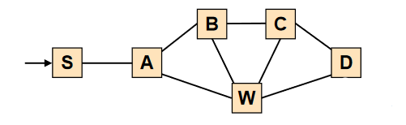

# Tulkun

## Planner
Tulkun planner use an invariant and network topology to generate DPVNet.

DPVNet is a DAG representing all paths in the network that matches path_exp.
DPVNet can be constructed in different ways.

DPVNet uses `.puml` format, the generated DPVNet can be viewed through [PlantUML](https://plantuml.com/).
# Tulkun

## Planner
Tulkun planner use an invariant and network topology to generate DPVNet.

DPVNet is a DAG representing all paths in the network that matches path_exp.
DPVNet can be constructed in different ways.

DPVNet uses `.puml` format, the generated DPVNet can be viewed through [PlantUML](https://plantuml.com/).

required:
- Python 3.9+

and install dependent libraries:
```shell
$ pip install -r .\scripts\requirements.txt
```
### Functionality Test

This test uses the following topology:



The following types of DPVNet are generated at once.

- **Reachability**  (D, \[S], (exist >= 1, S.*D)))
- **Waypoint**   (D, \[S], (exist >= 1, S.*W.*D))
- **Reachability with limited path length** (D, \[W], (exist >= 1, WD|W.D|W..D))
- **Different-ingress same reachability** (D, \[A, B], (exist >= 1, A.*D|B..D))
- **All-shortest-path reachability** (D, \[S], (equal, (S.*D, (==shortest))))
- **Non-redundant reachability** (D, \[S], (exist == 1, S.*D))

Run as follows:

```shell
$ cd scripts
$ python planner_test.py
```

After running, planner generates the corresponding puml file in the `\config\demo\` directory,  
 and you can use PlantUML tool to view the generated DPVNet.


### Evaluation Dateset

Running the `planner_test.py` file in the `.\scripts\` directory with parameters for the network name,  it automatically generates a DPVNet for all the pairs reachability required for Evaluation.

e.g.
```shell
$ cd scripts
$ python planner_test.py i2
```

The `DPVNet.puml` file is generated under `.\config\i2` when after running. This file does not need to be renamed because the verifier automatically uses the file with this name for verification tasks when it starts.

The network name parameter that can be used is any directory name under the directory `.\config\`, or you can customize the network according to the topology file format under any directory.

## Verification Simulations

Tulkun was used in a distributed network environment. This project provides a simulation to run distributed verification on a single machine and get the verification time.

it required:

- JDK 8
- Configure the necessary environment through the `pom.xml` file.
- Run the main class, located at:`src/main/java/Main.java`
- It is recommended to run the program in terminal, you can use the parameter '-h' to see all the available parameters.
- Whichever method you run with, make sure that you have a `config` directory in the runtime directory and that you have generated the DPVNet from *Evaluation datasets* .

### Burst Update

All forwarding rules are installed to corresponding switches all at once.
```shell
$ java -jar Tulkun.jar bs <network name> --show_result
```

Fill the network name in the corresponding location to run the burst update simulation and it will output the results later.


- Operational networks can be viewed in the `config` directory, or run `$ java jar Tunkun.jar list`  to view all operational networks.
- The number of runs can be set by the `-t` parameter to obtain stable evaluation results.
- The other parameters can be showed by using the `-h` parameter.


### Incremental Update

After the burst update, it will apply a number of rule updates and verify them one by one.
```shell
$ java -jar Tulkun.jar is <network name> --show_result
```
Fill the network name in the corresponding location to run the incremental update simulation and it will output the results later.


- Operational networks can be viewed in the `config` directory, or run `$ java jar Tunkun.jar list`  to view all operational networks.
- The maximum number of incremental updates can be set with the `-t` parameter.
- The other parameters can be showed by using the `-h` parameter.


